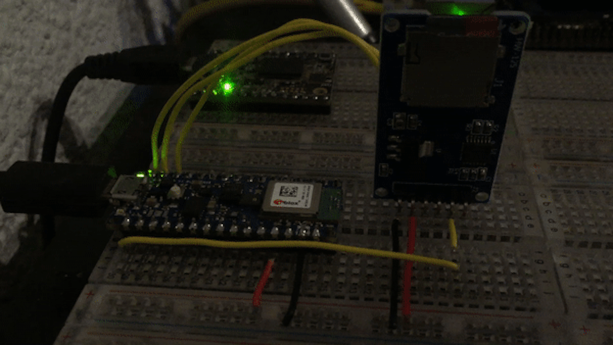

# Peter Moss Acute Myeloid & Lymphoblastic Leukemia AI Research Project
## Acute Lymphoblastic Leukemia Arduino Nano 33 BLE Sense Classifier

    

  

 

&nbsp;

# Table Of Contents

- [Introduction](#introduction)
- [DISCLAIMER](#disclaimer)
- [Motivation](#motivation)
- [Acute Lymphoblastic Leukemia](#acute-lymphoblastic-leukemia)
- [ALL IDB](#all-idb)
- [Segmentation](#segmentation)
- [Getting Started](#getting-started)
- [Contributing](#contributing)
  - [Contributors](#contributors)
- [Versioning](#versioning)
- [License](#license)
- [Bugs/Issues](#bugs-issues)

&nbsp;

# Introduction

The **Acute Lypmhoblastic Leukemia Arduino Nano 33 BLE Sense Classifier** is an experiment to explore how low powered microcontrollers, specifically the Arduino Nano 33 BLE Sense, can be used to detect Acute Lymphoblastic Leukemia. The [Arduino Nano 33 BLE Sense](https://store.arduino.cc/arduino-nano-33-ble-sense) is the latest Arduino Board  which supports  Tensorflow Lite, allowing machine learning on Arduino.

The model you will train is a 6 layer Convoluntional Neural Network trained using [Intel® Optimization for Tensorflow*](https://software.intel.com/content/www/us/en/develop/articles/intel-optimization-for-tensorflow-installation-guide.html) from the  [Intel® oneAPI AI Analytics Toolkit](https://software.intel.com/content/www/us/en/develop/tools/oneapi/ai-analytics-toolkit/download.html?operatingsystem=linux) to optimize and accelerate the training process.

Checkout the [official video](https://www.youtube.com/watch?v=CDJEXdj2KZs) for the project.

&nbsp;

# DISCLAIMER

_This project should be used for research purposes only. The purpose of the project is to show the potential of Artificial Intelligence for medical support systems such as diagnostic systems._

_Although the model is accurate and shows good results both on paper and in real world testing, it is trained on a small amount of data and needs to be trained on larger datasets to really evaluate it's accuracy._

_Developers that have contributed to this repository have experience in using Artificial Intelligence for detecting certain types of cancer. They are not doctors, medical or cancer experts._

&nbsp;

# Motivation

The motivation for this project was to explore how low powered devices such as Arduino can be used to detect Acute Lymphoblastic Leukemia. The project will be submitted to the Tensorflow For Microcontroller Challenge and the Eyes on Edge: tinyML Vision Challenge.

&nbsp;

# Acute Lymphoblastic Leukemia
[Acute lymphoblastic leukemia (ALL)](https://www.leukemiaairesearch.com/research/leukemia), also known as acute lymphocytic leukemia, is a cancer that affects the lymphoid blood cell lineage. It is the most common leukemia in children, and it accounts for 10-20% of acute leukemias in adults. The prognosis for both adult and especially childhood ALL has improved substantially since the 1970s. The 5- year survival is approximately 95% in children. In adults, the 5-year survival varies between 25% and 75%, with more favorable results in younger than in older patients.

For more information about Acute Lymphoblastic Leukemia  please visit our [Leukemia Information Page](https://www.leukemiaairesearch.com/research/leukemia)

&nbsp;

# ALL-IDB

You need to be granted access to use the Acute Lymphoblastic Leukemia Image Database for Image Processing dataset. You can find the application form and information about getting access to the dataset on [this page](https://homes.di.unimi.it/scotti/all/#download) as well as information on how to contribute back to the project [here](https://homes.di.unimi.it/scotti/all/results.php). If you are not able to obtain a copy of the dataset please feel free to try this tutorial on your own dataset, we would be very happy to find additional AML & ALL datasets.

&nbsp;

# Getting Started

To get started follow the [official documentation](docs/index.md).

&nbsp;

# Contributing
Asociación de Investigacion en Inteligencia Artificial Para la Leucemia Peter Moss encourages and welcomes code contributions, bug fixes and enhancements from the Github community.

Please read the [CONTRIBUTING](CONTRIBUTING.md "CONTRIBUTING") document for a full guide to forking our repositories and submitting your pull requests. You will also find our code of conduct in the [Code of Conduct](CODE-OF-CONDUCT.md) document.

## Contributors
- [Adam Milton-Barker](https://www.leukemiaairesearch.com/association/volunteers/adam-milton-barker "Adam Milton-Barker") - [Asociación de Investigacion en Inteligencia Artificial Para la Leucemia Peter Moss](https://www.leukemiaresearchassociation.ai "Asociación de Investigacion en Inteligencia Artificial Para la Leucemia Peter Moss") President/Founder & Lead Developer, Sabadell, Spain

&nbsp;

# Versioning
We use [SemVer](https://semver.org/) for versioning.

&nbsp;

# License
This project is licensed under the **MIT License** - see the [LICENSE](LICENSE "LICENSE") file for details.

&nbsp;

# Bugs/Issues
We use the [repo issues](issues "repo issues") to track bugs and general requests related to using this project. See [CONTRIBUTING](CONTRIBUTING.md "CONTRIBUTING") for more info on how to submit bugs, feature requests and proposals.